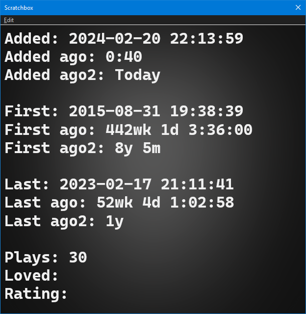

# Playcount 2003
[Download :material-download:](https://github.com/marc2k3/foo_playcount_2003/releases){ .md-button }

## Requirements
`foobar2000` `2.1` or later. `32bit` and `64bit` are both supported.

## Overview
This component uses the same database backend that `foo_playcount` utilises
for logging plays but has many more advanced features and fewer limitations.

- Playcounts and dates can edited for any context menu selection.
- Data can be imported from file tags or fields provided by other components.
- The current time is available via title formatting as a full date time string or Unix timestamp.
- First played, last played and added are all available as Unix timestamps.
- How records are bound to tracks can be configured in the `Advanced Preferences`.

## Advanced Preferences
The first thing you'll want to do after installing this is check `File>Preferences>Advanced>Tools>Playcount 2003`.


It's important that the main pattern and `Simple` or `Advanced` mode are decided on before starting as any change causes immediate data loss.
`foobar2000` will prompt you to restart when changing any setting.

### Title format pattern
This is how database records are bound to your tracks. The default of `%path%|%subsong%` does
mean every track will have unique data.

!!! note
	As of `0.1-Beta.6`, statistics can survive files being moved or copied when using [file operations](https://wiki.hydrogenaud.io/index.php?title=Foobar2000:File_Operations_(foo_fileops)).
	Cuesheets/other tracks with multiple chapters are not supported. If that is not acceptable,
	you should change it to a pattern that makes use of tags instead. You might consider a pattern like

	```
	%album artist%|%album%|%date%|%discnumber%|%tracknumber%|%title%
	```

### Log track as played
!!! note
	This is only available in component version `0.2` and later. These settings can be changed at anytime.

The default is to use the same internal method as `foo_playcount`. This means you have to listen to at least 1 minute for it to count. You have to listen to the whole track if it's shorter.

Now you can customise the time in seconds by entering a number or making it dynamic by using title formatting.

You must take care to cover every scenario because there is no safety net. For example if you enter `30`, no track shorter than that will ever count.

Therefore you should consider using `%length_seconds%`.

!!! example
	```
	// 20%
	$div(%length_seconds%,5)

	// half the track length or 30 seconds, whichever is lower
	$if(%length_seconds%,$min($div(%length_seconds%,2),30),)
	```

If the title format pattern does not evaluate to a number, the track won't be logged.

## Data retention
Database records are remembered for 4 weeks when not monitored as part of the `Media Library` or any loaded playlist. This behaviour is the same as `foo_playcount`.

## Available fields
These fields are available globally in `foobar2000` in any playlist columns/search/3rd party panel.

``` markdown title="Full date/time strings"
%2003_now%
%2003_added%
%2003_first_played%
%2003_last_played%
```

``` markdown title="Unix timestamps (number of seconds since 1st January 1970)"
%2003_now_ts%
%2003_added_ts%
%2003_first_played_ts%
%2003_last_played_ts%
```

```markdown title="Numbers"
%2003_playcount%
%2003_loved%
%2003_rating%
```

```markdown title="Calculated difference since now, formatted in weeks, days, hours, minutes, seconds"
%2003_added_ago%
%2003_first_played_ago%
%2003_last_played_ago%
```

```markdown title="Calculated difference since now, formatted in years and months. Weeks and days are only shown if less than one year"
%2003_added_ago2%
%2003_first_played_ago2%
%2003_last_played_ago2%
```

!!! example
	```
	Added: %2003_added%
	$crlf()
	Added ago: %2003_added_ago%
	$crlf()
	Added ago2: %2003_added_ago2%
	$crlf()
	$crlf()
	First: %2003_first_played%
	$crlf()
	First ago: %2003_first_played_ago%
	$crlf()
	First ago2: %2003_first_played_ago2% 
	$crlf()
	$crlf()
	Last: %2003_last_played%
	$crlf()
	Last ago: %2003_last_played_ago%
	$crlf()
	Last ago2: %2003_last_played_ago2%
	$crlf()
	$crlf()
	Plays: %2003_playcount%
	$crlf()
	Loved: %2003_loved%
	$crlf()
	Rating: %2003_rating%
	```

	

Ratings and loved values are set via the context menu for any playlist/library selection.

### Added
`Added` times are generated automatically for `Media Library` items only. This happens when `foobar2000`
starts or when new library items are added. If you clear data via the context menu, the `Added` field
will remain empty until the next restart or the next play or import.

`Added` dates can be edited via the context menu. Selecting this option will open an edit
dialog where you can update it using any valid date/time string in `YYYY-MM-DD HH:MM:SS` format.
The component will not check if selection items belong to the library when writing.

!!! note
	Strictly speaking, the earliest supported date/time is `1970-01-01 00:00:01`. As Unix timestamps are used
	internally, zero is reserved for indicating not set. The latest value is some time in the year 2106
	because 32bit unsigned integers are used for storage.

## Data import / export
You can import/export data either via the main menu > `Library>Playcount 2003` or use the context menu
on any playlist/library selection. When importing, files must be `UTF8`. With or without `BOM` is
fine. Exported files are always without `BOM`.

## Command line support
You can import `JSON` files via the command line like this:

```
.\foobar2000.exe /playcount_2003_import:filename.json
```

The file path must be relative to the user profile folder.

## Simple mode
The main `Edit` dialog found under the context menu > `Playcount 2003>Edit` now supports `Presets` and
you can import data from `foo_playcount` or `foo_lastfm_playcount_sync` as illustrated here:


In addition to `Presets`, you can fill in values manually or use title formatting to import data from tags/other
components.

## Advanced mode
```markdown title="Advanced mode exclusive fields"
%2003_timestamps%
%2003_playcount_this_year%
%2003_playcount_last_year%
```

`%2003_timestamps%` is a stringified array of timestamps and this tracks every single play as you listen. This functionality
originated in `foo_enhanced_playcount`. `JavaScript` component users can use `JSON.parse` to manipulate it.

The playcount/first played/last played values are extrapolated from the contents of this array so editing
via the context menu is not supported.

`%2003_playcount_this_year%` / `%2003_playcount_last_year%` aggregate plays for the given years.

### Working with JScript Panel 3
!!! note
	With minor adjustments, this could work with any scripting component. They all provide
	the same functionality.

Since first played/last played/playcounts are not editable in `Advanced` mode, you can generate your own
`JSON` files to import. Using the exact same title format pattern from the `Advanced` preferences, you
can generate an `id` for each entry like this:

```js
var items = plman.GetPlaylistItems(plman.ActivePlaylist);
var tfo_id = fb.TitleFormat("%path%|%subsong%");
var arr = [];

for (var i = 0; i < items.Count; i++) {
	var item = items.GetItem(i);
	var obj = {
		"id" = tfo_id.EvalWithMetadb(item),
		// empty array on purpose, scripters should know what to do!
		// must be Unix timestamps (seconds, not milliseconds)
		"2003_timestamps" : [],
	};
	arr.push(obj);
}
var str = JSON.stringify(arr);
// save to file
```

## Changes

### 0.2
- You can now configure how much you have to listen to a track before it counts as a play. The default using the same rules as `foo_playcount` remains unchanged. See [here](#log-track-as-played).

### 0.1.9
- Fix `Edit` dialog text truncation and crash bugs.

### 0.1.8
- The `Edit` dialog now supports dates in `YYYY-MM-DD` format. The time will be set to `00:00:00` automatically.

### 0.1.7
- Add workaround for horrible library initialisation bug which prevented library viewers like `Album List` from populating themselves on startup.

### 0.1.6
- Update `Edit` dialog with `Rating` field. Although setting the `Rating` via the context menu was always possible, it wasn't possible to import ratings from `foo_playcount`. This change allows that.

### 0.1.5
- Fix bug where `OK` button in `Edit` dialog remained disabled after choosing a history item from the dropdown.
- Update the file importer in `Advanced` mode. Previously, any timsestamps that were identical for a given track were discarded. Now the check expands and assumes any timestamps within 10 seconds of each other are duplicates. Just to be clear, this is per track.

### 0.1.4
- Add the following fields:
```
%2003_added_ago2%
%2003_first_played_ago2%
%2003_last_played_ago2%
```

See [here](#common-features)

### 0.1.3
- Editing values via the context menu now reports how many items were updated in the console.
- The file importer now accurately reports how many items were updated by only counting when values were modified.

### 0.1.2
- Minor file import tweaks.

### 0.1.1
- Fix bug with context menu items for marking selections as loved/unloved.

### 0.1
- Initial release
