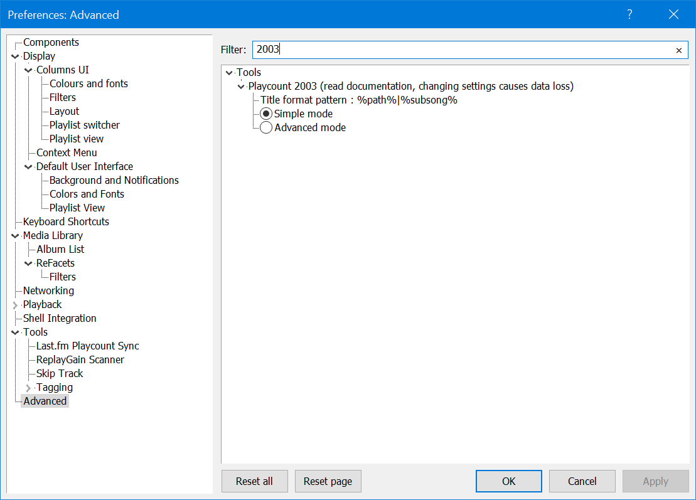

# Playcount 2003

[Download :material-download:](https://github.com/marc2k3/foo_playcount_2003/releases){ .md-button }

!!! note
	The minimum requirement is `Windows 7+` and `foobar2000` `2.1+`

## Overview
This component uses the same database backend that `foo_playcount` utilises
for logging plays but has many more advanced features and fewer limitations.

## Advanced Preferences
The first thing you'll want to do after installing this is check `File>Preferences>Advanced>Tools>Playcount 2003`.



It's important that settings are decided on before starting as any change causes immediate data loss.
`foobar2000` will prompt you to restart when changing any setting.

### Title format pattern
This is how database records are bound to your tracks. The default of `%path%|%subsong%` does
mean every track will have unique data.

!!! note
	As of `0.1-Beta.6`, statistics can survive files being moved or copied when using [file operations](https://wiki.hydrogenaud.io/index.php?title=Foobar2000:File_Operations_(foo_fileops)).
	Cuesheets/other tracks with multiple chapters are not supported. If that is not acceptable,
	you should change it to a pattern that makes use of tags instead. You might consider a pattern like

	```
	%album artist%|%album%|%date%|%discnumber%|%tracknumber%|%title%
	```

### Common features
Both `Simple` and `Advanced` mode have these same common features:

- database records are remembered for 4 weeks when not monitored as part of the `Media Library` or any loaded playlist. This behaviour is the same as `foo_playcount`.
- Like `foo_playcount`, tracks are logged after one minute of playback or when playback ends if shorter than one minute.

These fields are available globally in `foobar2000` in any playlist columns/search/3rd party panel.

``` markdown title="Full date/time strings"
%2003_now%
%2003_added%
%2003_first_played%
%2003_last_played%
```

``` markdown title="Unix timestamps (number of seconds since 1st January 1970)"
%2003_now_ts%
%2003_added_ts%
%2003_first_played_ts%
%2003_last_played_ts%
```

```markdown title="Numbers"
%2003_playcount%
%2003_loved%
%2003_rating%
```

```markdown title="Calculated difference since now, formatted in weeks, days, hours, minutes, seconds"
%2003_added_ago%
%2003_first_played_ago%
%2003_last_played_ago%`
```

Ratings and loved values are set via the context menu for any playlist/library selection. The last thing
in common is the ability to change the `Added` date via the context menu. Selecting this option will open an input
box where you can update it using any valid date/time string in `YYYY-MM-DD HH:MM:SS` format.

!!! note
	Strictly speaking, the earliest supported value is `1970-01-01 00:00:01`. As Unix timestamps are used
	internally, zero is reserved for indicating not set. The latest value is some time in the year 2106
	because 32bit unsigned integers are used for storage.

!!! note
	`Added` times are generated automatically for `Media Library` items only. This happens when `foobar2000`
	starts or when new library items are added. If you clear data via the context menu, the `Added` field
	will remain empty until the next restart or the next play or import.

### Data import
You can import/export data either via the main menu > `Library>Playcount 2003` or use the context menu
on any playlist/library selection. Note that data from `Simple` mode is not compatible with `Advanced`
mode. When importing, files must be `UTF8`. With or without `BOM` is fine as of `0.1` `Final`. Exported
files are always without `BOM`.

## Simple mode
!!! note 
	The dedicated `foo_playcount` import option on the main `Library` menu has been removed in `0.1` final.

The main `Edit` dialog found under the context menu > `Playcount 2003>Edit` now supports `Presets` and
you can import data from `foo_playcount` or `foo_lastfm_playcount_sync` as illustrated here:


In addition to `Presets`, you can fill in values manually or use title formatting to import data from tags/other
components.

## Advanced mode
```markdown title="Advanced mode exclusive fields"
%2003_timestamps%
%2003_playcount_this_year%
%2003_playcount_last_year%
```

`%2003_timestamps%` is a stringified array of timestamps and this tracks every single play as you listen. This functionality
originated in `foo_enhanced_playcount`. `JavaScript` component users can use `JSON.parse` to manipulate it.

The playcount/first played/last played values are extrapolated from the contents of this array so editing
via the context menu is not supported.

`%2003_playcount_this_year%` / `%2003_playcount_last_year%` aggregate plays for the given years and provide
easy title formatting without any complicated `JavaScript` voodoo.

### Javscript voodoo
Since first played/last played/playcounts are not editable in `Advanced` mode, you can generate your own
`JSON` files to import. Using the exact same title format pattern from the `Advanced` preferences, you
can generate an `id` for each entry like this:

```js
var items = plman.GetPlaylistItems(plman.ActivePlaylist);
var tfo_id = fb.TitleFormat("%path%|%subsong%");
var arr = [];

for (var i = 0; i < items.Count; i++) {
	var item = items.GetItem(i);
	var obj = {
		"id" = tfo_id.EvalWithMetadb(item),
		// empty array on purpose, scripters should know what to do!
		// must be Unix timestamps (seconds, not milliseonds)
		"2003_timestamps" : [],
	};
	arr.push(obj);
}
var str = JSON.stringify(arr);
// save to file
```

### Command line support
Finally, you can import `JSON` files via the command line like this:

```
.\foobar2000.exe /playcount_2003_import:filename.json`.
```

The file path must be relative to the user profile folder and it must be `UTF8`. As
of `0.1` `Final`, with or without `BOM` is fine.

## Changes
### 0.1.2 (unreleased)
- Fix potentially misleading file import error. If no matches were found, it was reported that no matching `Media Library` items were found which is not the case for context based selections.

### 0.1.1
- Fix bug with context menu items for marking selections as loved/unloved.

### 0.1
- Remove `foo_playcount` importer from main `Library` menu.
- The `Edit` dialog for context menu selections now has built in `Presets`. See [here](#simple-mode).
- Implement drop down history on the `Edit` dialog text boxes. Only title format patterns are remembered. Other plain text entry is not.
- Add support for importing `JSON` files with `UTF8-BOM`.

### 0.1-Beta.8
- Update edit dialog with title format support.

### 0.1-Beta.7
- Fix stupid bug with foo_playcount importer.

### 0.1-Beta.6
- Add file operation callback.

### 0.1-Beta.5
- Enforce stricter validation on user imported values.

### 0.1-Beta.4
- The format of exported files has changed so previously saved files cannot be imported. Apologies for the inconvenince but this is still beta!
- Add `%2003_first_played_ago%`, `%2003_last_played_ago%` and `%2003_added_ago%`.
- The `Library` import options now prompt you that all existing data will be cleared first. If you don't want that, use the new context menu options which will merge instead.
- Add simple/advanced modes.
- Add command line handler for importing `JSON`.

### 0.1-Beta.3
- Add import/export options to the main menu `Library>Playcount 2003`.

### 0.1-Beta.2
- Provide feeback when importing from foo_playcount.
- Expose current date/time as string and timestamp (`%2003_now%`, `%2003_now_ts%`).
- Expose existing date/time strings as timestamps (`%2003_first_played_ts%`, `%2003_last_played_ts%` and `%2003_added_ts%`).

### 0.1-Beta.1
- Initial release